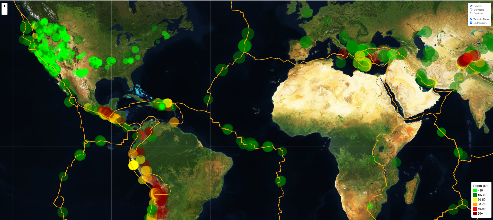
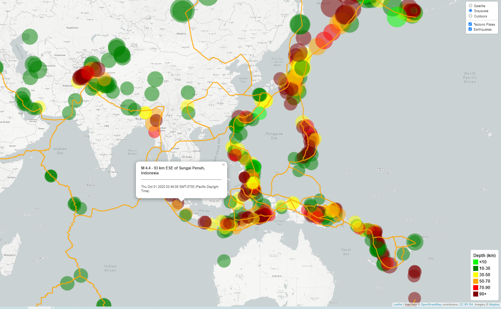
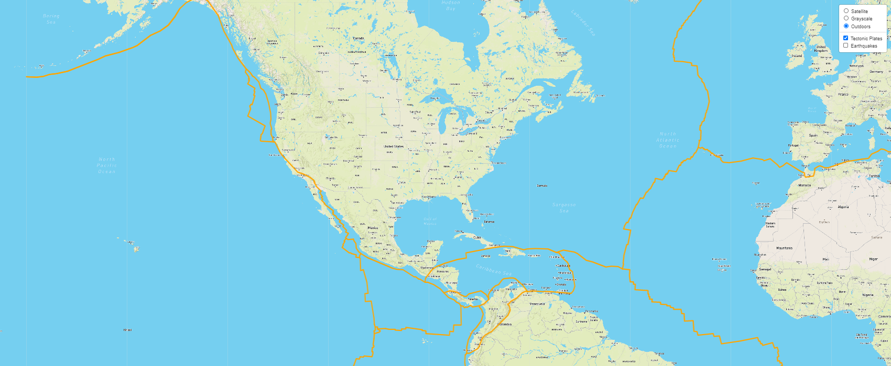

# Leaflet-challenge - Visualizing Data with Leaflet

## Background

Welcome to the United States Geological Survey, or USGS for short! The USGS is responsible for providing scientific data about natural hazards, the health of our ecosystems and environment; and the impacts of climate and land-use change. Their scientists develop new methods and tools to supply timely, relevant, and useful information about the Earth and its processes. As a new hire, you will be helping them out with an exciting new project!

The USGS is interested in building a new set of tools that will allow them visualize their earthquake data. They collect a massive amount of data from all over the world each day, but they lack a meaningful way of displaying it. Their hope is that being able to visualize their data will allow them to better educate the public and other government organizations (and hopefully secure more funding..) on issues facing our planet.

The map can be accessed at: https://nsheikh23.github.io/leaflet-challenge/

## Tasks Performed

1. Imported the GeoJSON data for all earthquakes in the past 30 days from the USGS website: 
https://earthquake.usgs.gov/earthquakes/feed/v1.0/geojson.php

2. Created a map using Leaflet with the latitude and longitude from the data.

   * Multiple base maps were created to allow user interaction.

   * Earthquakes overlay map was created using the data imported.
   
   * The size of the marker was determined by the magnitude of the earthquake, while the color was determined by the depth. For example, earthquakes with higher magnitudes appear larger in radius, while earthquakes that are deeper are colored darker as shown in the legend.

   * Popups were bound to each event that provide details on location and time.

   * A legend was created to provide context of the map.

3. Imported additional GeoJSON data on tectonic plates from:
https://raw.githubusercontent.com/fraxen/tectonicplates/master/GeoJSON/PB2002_boundaries.json

   * This data illustrated a relationship between the tectonic plates and the seismic activity

   * Another overlay map was created for tectonic plates that gives the user power to turn on or off each layer independently.

## Analysis
As expected, it can be seen that majority of the earthquakes occurred at the boundaries of the tectonic plates. However, something interesting to note is the depth of these earthquakes. In North America, it can be seen there were numerous events but they were mostly less than 10km deep. In contrast, western South America had seemingly fewer earthquakes but they were much deeper. There appears to be greater stress between the Nazca plate and South American plate. A similar pattern can be observed in the Pacific with the Pacific plate clashing with the Australian, the Filipino, and the North American plates. There is a lot of tension causing deeper earthquakes.

In the future I would like to continue this project and add heatmap, clusters and a timelapse. 

### Satellite Image

### Grayscale Image

### Outdoors Image

